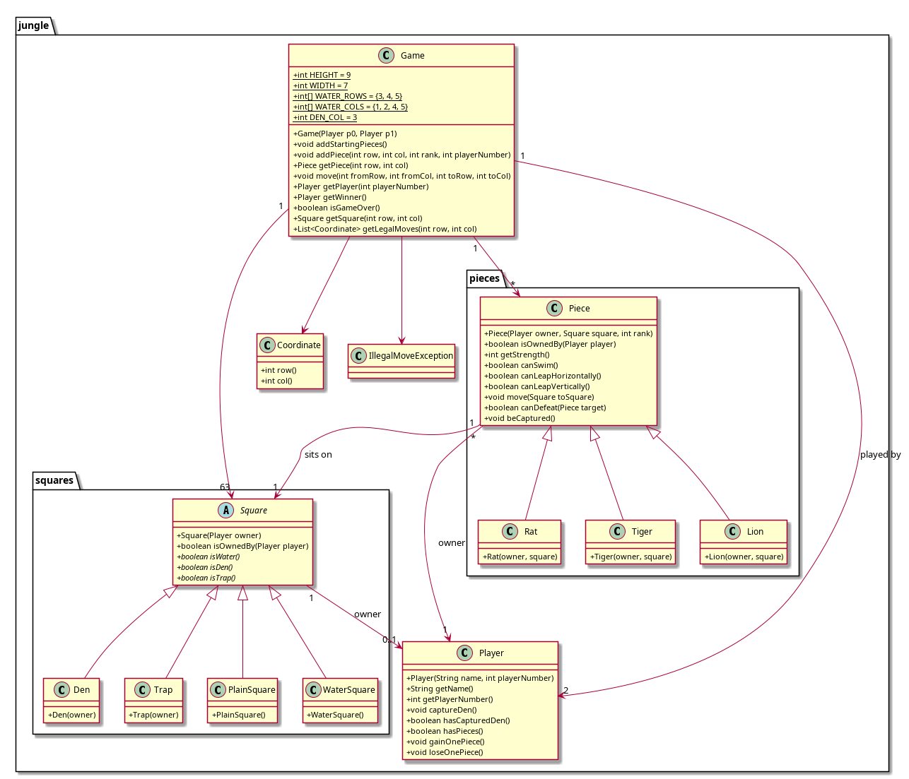

# Jungle Board Game Model

## Introduction

This project is a Java-based implementation of the Jungle board game, a two-player strategy game involving pieces with varying ranks on a 7x9 board. The objective is to either capture all of your opponent's pieces or move one of your own pieces into their den.

This project is the model only, it does not include a user interface or a main method.

---

## Features

### Gameplay
- Implements all game rules, including:
  - Piece movement and capturing.
  - Special abilities for certain pieces (e.g., rat, lion, tiger).
  - Victory conditions (capturing all opponent pieces or entering the opponent’s den).

### Architecture
- **`jungle`**: Core game logic and main components.
- **`jungle.pieces`**: Subclasses for game pieces (e.g., Lion, Tiger, Rat) with unique behaviors.
- **`jungle.squares`**: Specialized board squares (e.g., water, trap, den).

### Error Handling
- `IllegalMoveException` for invalid game moves.
- `IndexOutOfBoundsException` for out-of-range board coordinates.
- `IllegalArgumentException` for invalid player inputs.

---

## Setup and Execution

1. Clone or download the repository to your local machine.
2. Navigate to the root directory of the project.
3. Call the packages and classes as needed in your own project.
